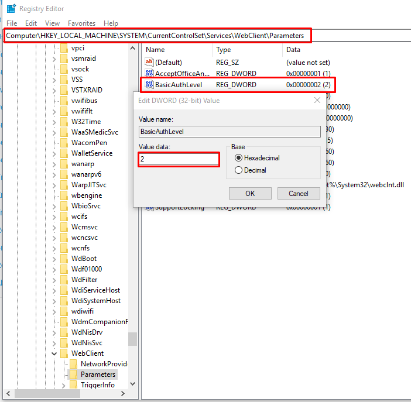
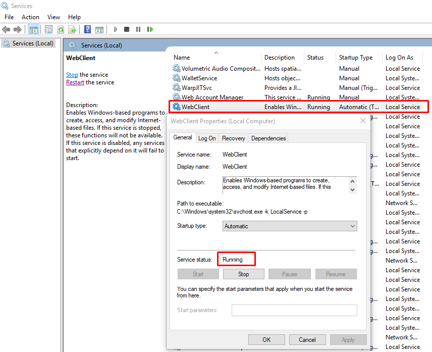

## Accessing files using Linux 

You can access files in Linux by using Nautilus (using `dav//` or `davs//`  protocol)

or 

## Accessing files using MacOS

Finder > Go > Connect to Server ... 

Enter URL to access, by example:

http://172.27.100.14/remote.php/dav/files/USERNAME/

## Accessing files using Windows 

then 

#### Troubleshoot

Open `regedit` by Run (Windows+R)

Ensure that `BasicAuthValue = 2`

Then restart service `WebClient` 

